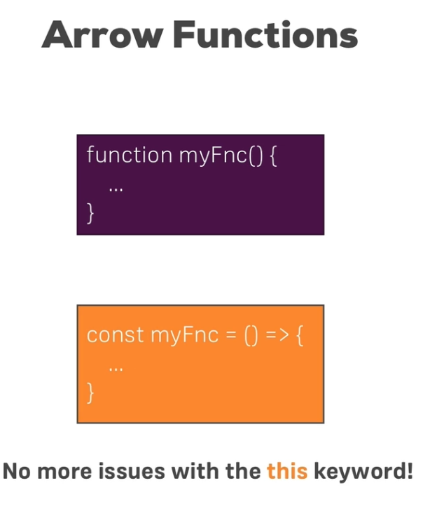

# I. Let and const
* `var` is the old
* `let` is the new
* `const` is the new, but just constant

# Test


# II. Arrow function!
https://aisit.udemy.com/course/react-the-complete-guide-incl-redux/learn/lecture/8211786#notes


## A. Old
```
function printMyName(name) {
    console.log(name);
};

printMyName('Duke');
```

## B. Arrow
* eliminates issues with *this* keyword
```
const printMyName = (name) => {
    console.log(name);
}

printMyName('Duke');

```

## B. One-argument Arrow
* eliminates issues with *this* keyword
```
const printMyName = name => { // you don't need name
    console.log(name);
}

printMyName('Duke');

```

## C. No-arugment Arrow
```
const printMyName = () => { // must include ()
    console.log('Duke');
}

printMyName();

```

## D. Two-or-more Arrow
```
const printMyName = (name, age) => { 
    console.log(name, age);
}

printMyName('Duke', 31);

```

## E. Return, short Arrow

The following two are equivalent:

```
const multiplyByTwo = (number) => { 
    return number * 2
}

console.log(multiplyByTwo(2)); // prints 4

```

Shorter version:

```
const multiplyByTwo = (number) =>  number * 2

console.log(multiplyByTwo(2)); // prints 4

```